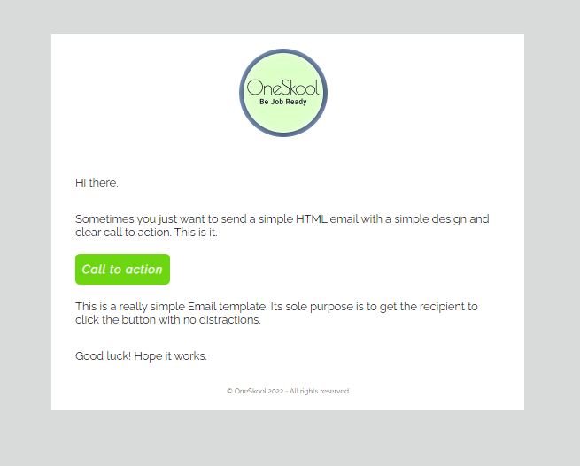

# Email-template-2

> This is an Email Template small project can be used to send emails as a template. 



## Built With

- HTML
- CSS
- MDB server

## Live Demo

https://elyor-email-template-1.mdbgo.io


## Clone This Project
```
- git clone `$ https://github.com/elyor-doniyorov/Email-template-2.git`
- cd Email-template-2
```

## Send Email using
```
- website https://putsmail.com/tests to check email template is working or not
```

## Authors

👤 **Elyor Doniyorov**

- Github: [@elyor-doniyorov](https://github.com/elyor-doniyorov)
- LinkedIn: [@elyor-doniyorov](www.linkedin.com/in/elyor-doniyorov)


## 🤝 Contributing

Contributions, issues, and feature requests are welcome!

Feel free to check the [issues page](https://github.com/elyor-doniyorov/Email-template-2/issues/1).

## Show your support

Give a ⭐️ if you like this project!
